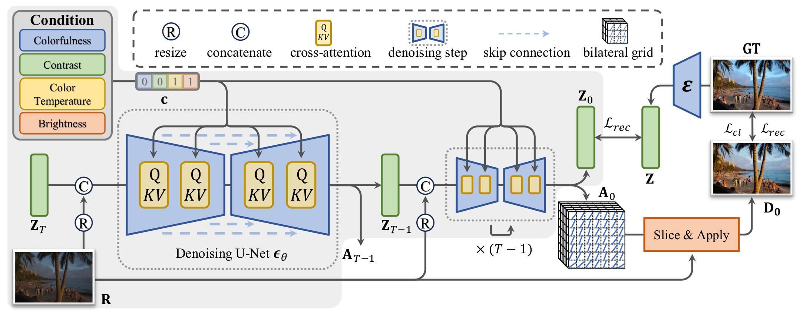
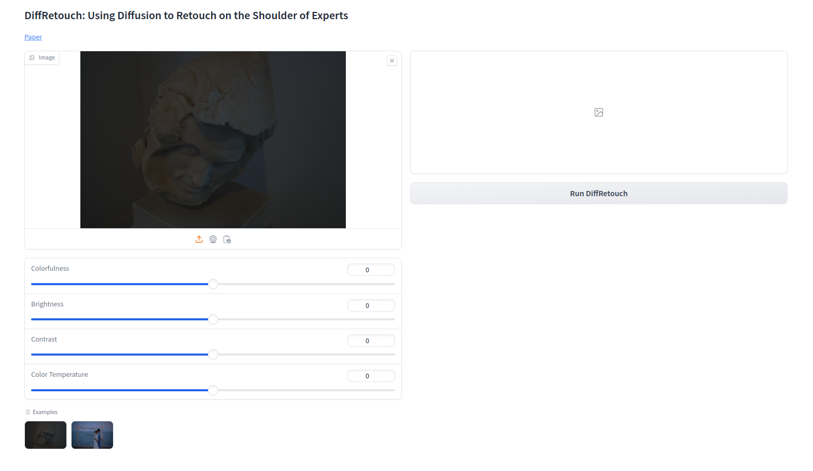

# :fire: DiffRetouch: Using Diffusion to Retouch on the Shoulder of Experts (AAAI2025)

<a href='https://arxiv.org/abs/2407.03757'></a> &nbsp;&nbsp;
<a href='https://adam-duan.github.io/projects/retouch/'></a> &nbsp;&nbsp;
<!-- <a href=''></a> &nbsp;&nbsp; -->


This is the official PyTorch codes for the paper: 

>**DiffRetouch: Using Diffusion to Retouch on the Shoulder of Experts**<br>  [Zhengpeng Duan<sup>1,2</sup>](https://adam-duan.github.io/), [Jiawei Zhang<sup>2</sup>](https://sites.google.com/site/zhjw1988), [Zheng Lin<sup>4</sup>](https://lin-zheng.com/), [Xin Jin<sup>1</sup>](https://srameo.github.io/), [Xun-Dong Wang<sup>5</sup>](), [Dongqing Zou<sup>2,3</sup>](), [Chunle Guo<sup>1,6</sup>](https://scholar.google.com/citations?user=RZLYwR0AAAAJ&hl=en), [Chongyi Li<sup>1,6,&dagger;</sup>](https://li-chongyi.github.io/) <br>
<sup>1</sup> VCIP, CS, Nankai University, <sup>2</sup> SenseTime Research, <sup>3</sup> PBVR, <sup>4</sup> BNRist, Department of Computer Science and Technology, Tsinghua University, <sup>5</sup> Wuhan University of Technology, <sup>6</sup> NKIARI, Shenzhen Futian  <br>
<sup>&dagger;</sup>Corresponding author.




:star: If DiffRetouch is helpful to your images or projects, please help star this repo. Thank you! :point_left:


## :wrench: Dependencies and Installation

1. Clone repo

```bash
git clone https://github.com/adam-duan/DiffRetouch.git
cd DiffRetouch
```

2. Install packages
```bash
conda env create --file environment.yaml
conda activate diffretouch
```


## :surfer: Quick Inference


**Step1: Download Checkpoints**

Download the [[checkpoints](https://huggingface.co/acceptee/DiffRetouch)] and place them in the following directories: `diffretouch_models/`.

**Step2: Prepare testing data**

Download the [[test_data.zip](https://huggingface.co/acceptee/DiffRetouch)] and unzip it.

**Step 3: Running testing command**

```bash
bash test_adobe.sh/test_ppr.sh \
    promptdir      \      # Specify the expert style, e.g. '01-Experts-A' for Adobe5K and 'target_a' for PPR10K
    seed           \      # Set the random seed
    steps          \      # Set the number of diffusion steps, 20 by default
```

**Step 4: Check the results**

The processed results will be saved in the `results/` directory.

**:seedling: Gradio Demo**
```bash
python gradio_diffretouch.py \
    --ckpt_path   \       # Specify the checkpoint path, e.g. 'diffretouch_models/adobe.ckpt'
```



## 📜 License

This project is licensed under the Pi-Lab License 1.0 - see the [LICENSE](https://github.com/Adam-duan/DiffRetouch/blob/main/LICENSE) file for details.

## :book: Citation

If you find our repo useful for your research, please consider citing our paper:

```bibtex
@inproceedings{duan2025diffretouch,
  title={DiffRetouch: Using Diffusion to Retouch on the Shoulder of Experts},
  author={Duan, Zheng-Peng and Zhang, Jiawei and Lin, Zheng and Jin, Xin and Wang, XunDong and Zou, Dongqing and Guo, Chun-Le and Li, Chongyi},
  booktitle={Proceedings of the AAAI Conference on Artificial Intelligence},
  year={2025}
}
```

## :postbox: Contact

For technical questions, please contact `adamduan0211[AT]gmail.com`
